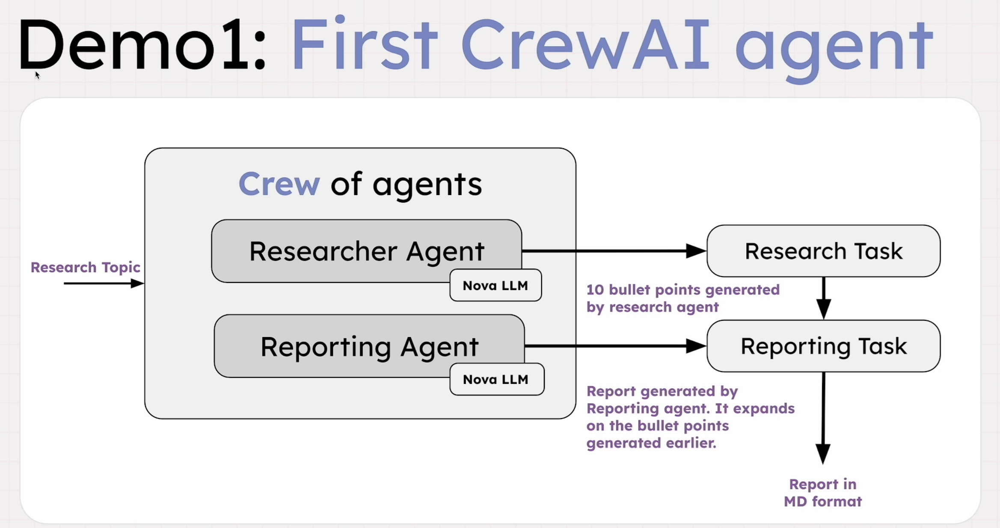
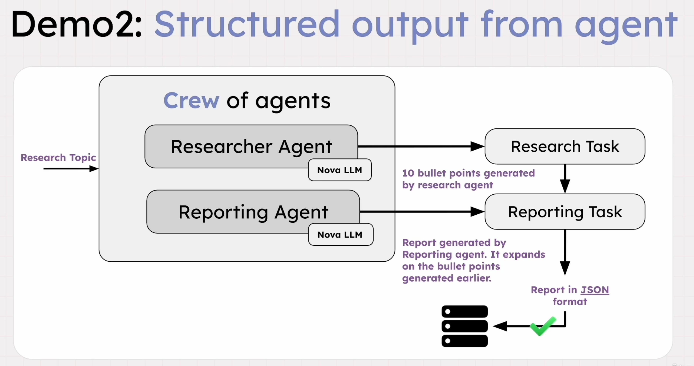

# [CrewAI](https://crewai.com/)
 Open-source Python framework for orchestrating autonomous AI agents to collaborate on complex tasks, acting as a management layer for multi-agent workflows.

## Demo - Basic setup with output in MD format

## Demo - Basic setup with output in JSON

